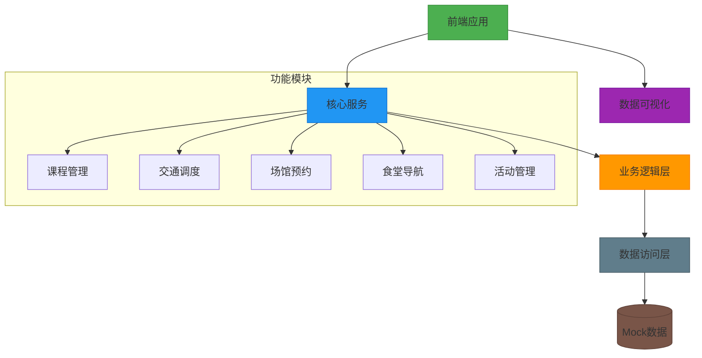
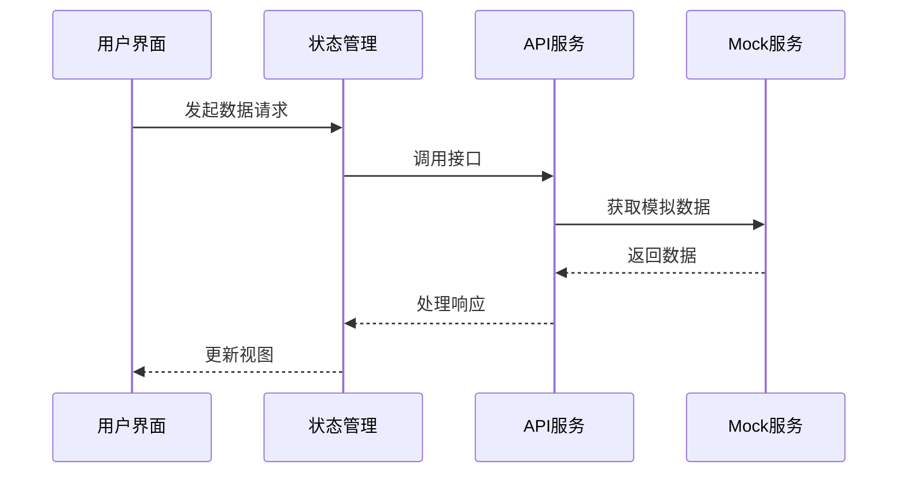

# 校园智慧服务系统 Demo

## 项目简介
基于React构建的校园综合服务系统，集成课程管理、交通查询、场馆预约等核心功能。主要模块包括：
- 🎓 智能课程表：支持多条件课程查询与提醒
- 🚌 实时校园巴士：可视化路线与车辆状态监控
- 🏟 场馆使用：实时容量查询与预约管理
- 🍜 食堂导航：窗口排队情况与热门菜品展示
- 📅 活动日历：校园活动信息聚合与提醒

## 技术架构
### 核心框架
- React 18 + TypeScript 5
- Vite 4 构建工具
- React Router 6 路由管理

### UI体系
- Tailwind CSS 3 + Heroicons 2
- Framer Motion 10 交互动效

### 开发工具链
- ESLint 8 + TypeScript ESLint
- PostCSS + Autoprefixer

## 项目结构
```bash
├── public            # 静态资源
├── src
│   ├── assets        # 静态资源
│   ├── components    # 通用组件
│   │   └── Layout.tsx # 页面布局组件
│   ├── mock          # 模拟数据
│   │   └── data.ts   # 各模块数据模型
│   ├── pages         # 页面组件
│   │   ├── Bus.tsx    # 校园巴士
│   │   ├── Canteen.tsx # 食堂导航 
│   │   ├── Events.tsx # 活动日历
│   │   ├── Home.tsx   # 首页
│   │   ├── Map.tsx    # 校园地图
│   │   └── Venues.tsx # 场馆查询
│   ├── types         # TypeScript类型定义
│   └── App.tsx       # 应用根组件
```

## 环境配置
### 前置要求
- Node.js ≥16.0.0
- npm ≥8.0.0

### 快速启动
```bash
# 安装依赖
npm install

# 开发模式运行 (端口:5173)
npm run dev

# 生产构建
npm run build

# 预览生产版本
npm run preview
```

## 功能模块详解
### 课程管理模块
- 支持周次/星期/节次多维度筛选
- 教室位置地图集成
- 课程冲突检测

### 校园交通系统
- 实时巴士位置追踪
- 到站时间预测
- 车厢拥挤度提示

### 智能场馆系统
- 空间使用热力图
- 预约时段管理
- 设备状态监控

## 数据模型
采用TypeScript严格类型定义，核心模型包括：
```typescript
interface Course {
  id: string
  name: string
  teacher: string
  location: string
  weekday: number
  section: number[]
  weeks: number[]
}

interface BusRoute {
  id: string
  name: string
  stations: Station[]
  currentLocation: GeoPoint
  estimatedTime: number
  capacity: CapacityInfo
}
```

## 系统架构设计



### 核心模块交互


## 状态管理设计
```typescript
// 全局状态结构
interface AppState {
  courses: {
    data: Course[]
    filters: CourseFilter
    loading: boolean
  }
  transportation: {
    routes: BusRoute[]
    selectedRoute?: string
    realtime: RealtimeData
  }
  // 其他模块状态...
}

// 使用Zustand状态管理
const useStore = create<AppState>((set) => ({
  courses: { data: [], filters: {}, loading: false },
  transportation: { routes: [], realtime: {} },
  // 状态更新方法...
}))
```

## API接口规范
### 课程服务接口
```typescript
GET /api/courses
Params:
  - weekday: number (1-7)
  - week: number (1-16)
Response: Course[]

POST /api/courses
Body: Omit<Course, 'id'>
Response: Course
```

### 交通服务接口
```typescript
GET /api/bus-routes
Response: BusRoute[]

GET /api/bus-routes/:id/realtime
Response: {
  location: GeoPoint
  speed: number
  passengers: number
}
```

## 测试策略
### 单元测试
```bash
# 运行组件测试
npm test -- -t 'Component'

# 运行工具函数测试  
npm test -- -t 'Utils'
```

### E2E测试
```bash
# 安装Cypress
npm install -D cypress

# 启动测试运行器
npx cypress open
```

## 生产部署
### 环境变量配置
```env
VITE_API_BASE=http://api.yourschool.com
VITE_MAP_KEY=your_amap_key
```

### Docker部署
```dockerfile
FROM node:18-alpine as builder
WORKDIR /app
COPY package*.json ./
RUN npm ci
COPY . .
RUN npm run build

FROM nginx:1.23-alpine
COPY --from=builder /app/dist /usr/share/nginx/html
EXPOSE 80
```

### CI/CD配置
```yaml
name: Deploy
on:
  push:
    branches: [ main ]
jobs:
  build:
    runs-on: ubuntu-latest
    steps:
      - uses: actions/checkout@v3
      - uses: actions/setup-node@v3
        with:
          node-version: 18
      - run: npm ci
      - run: npm run build
      - uses: azure/webapps-deploy@v2
        with:
          app-name: 'campus-demo'
          publish-profile: ${{ secrets.AZURE_PUBLISH_PROFILE }}
          package: ./dist
```

## 设计理念
1. **组件化架构**：通过Layout组件实现统一页面结构，各功能模块独立封装
2. **状态驱动**：采用React Hooks管理模块状态，保持UI与数据同步
3. **响应式设计**：基于Tailwind CSS实现多端适配布局
4. **数据模拟**：通过mock数据层实现前后端解耦开发

## 项目路线图
| 阶段 | 目标 | 预计完成 |
|------|------|----------|
| 1.0  | 基础功能实现 | 2024 Q2 |
| 1.1  | 移动端适配优化 | 2024 Q3 |
| 2.0  | 实时通知系统 | 2024 Q4 |
| 3.0  | AI智能推荐 | 2025 Q1 |

## 贡献者指南
### 代码规范
- 遵循Airbnb JavaScript Style Guide
- TypeScript类型定义需通过ESLint校验
- 组件命名采用PascalCase

### 提交规范
```
<type>(<scope>): <subject>
// 示例
feat(bus): 新增实时位置刷新功能
fix(course): 修复周次筛选逻辑
```

## 扩展开发
```bash
# 安装ESLint类型检查插件
npm install -D @typescript-eslint/eslint-plugin

# 代码质量检查
npm run lint
